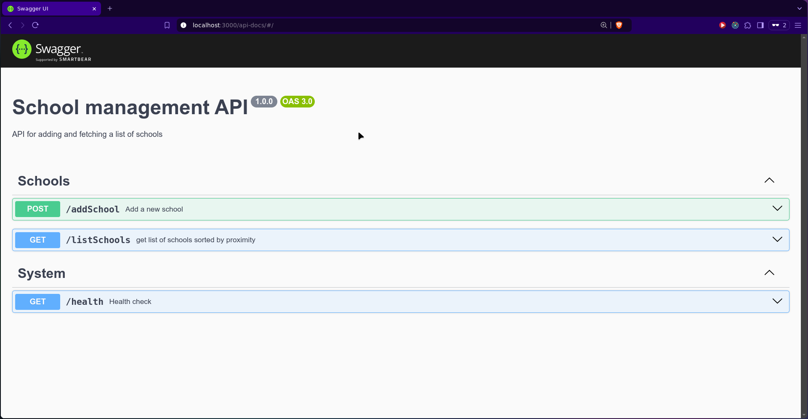

# School Management API

Nodejs restAPI for managing school data

## Unique Features

- **Health Monitoring**: System health checks with memory usage and uptime metrics
- **Rate Limiting**: IP-based rate limiting (30 requests/min) to prevent abuse
- **Logging**: Clean logs of all operations using debug library
- **OpenAPI/Swagger**: Interactive API documentation page
- **Geospatial Search**: Find schools sorted according to distance from user

## Optimizations

- **Indexed Geolocation**: Database indexing on latitude/longitude columns for faster queries
- **Connection Pooling**: MySQL connection pool for efficient database connections
- **In-Memory Distance Sorting**: Optimized distance calculations using Haversine formula
- **Response Caching**: Built-in Express response caching for frequently accessed data

## Project Structure

```
src/
├── config/
│   └── db.js         # Database configuration
├── controllers/
│   └── school.controller.js # controller logic
├── middleware/
│   ├── errorHandler.js     # error handling
│   └── rateLimiter.js     # rate limiting logic
├── models/
│   └── school.js          # database interaction logic
├── routes/
│   └── school.route.js
├── utils/
│   ├── geospatial.js
│   ├── asyncHandler       # wrapper for async operations
│   └── validator.js
├── openapi/
│   └── spec.yaml          # OpenAPI/Swagger spec file
└── server.js
```

## API Documentation

Clear API docs swagger page generated from spec file available at `/api-docs`



## Environment variables

```env
DBHOST=mysql-host
DBUSER=database-user
DBPASSWORD=database-password
DBPORT=database-port
DBNAME=schools
PORT=3000
```

## Setup

```bash
# Install dependencies
npm install

# Start development server
npm run dev

# Run tests
npm test
```

## API Endpoints

- `POST /api/v3/app/addSchool`: Add a new school
- `GET /api/v3/app/listSchools`: get list of schools sorted according to proximity

- `GET /health`: System health status

## Security Practices

- **Helmet.js**: secure HTTP headers
- **CORS**: cross-origin resource sharing
- **Input Validation**: request validation
- **Rate Limiting**: protection against abuse

## Debug Modes

used `debug` library with the following namespaces:

- `app:server`: main server operations
- `app:database`: Database configuration
- `app:school-controller`: controller file
- `app:school-model`: operations on db
